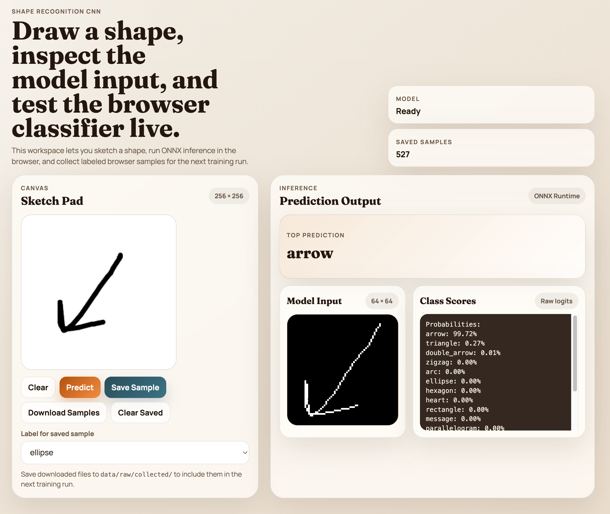

# Shape Recognition CNN



A production-ready Convolutional Neural Network (CNN) for recognizing hand-drawn shapes. This project combines synthetic data generation with real-world browser-collected samples to achieve robust recognition across 16 different shape classes.

## ✨ Features

- **Robust Recognition**: Supports 16 shapes including Ellipse, Triangle, Star, Heart, Arrow, and more.
- **Ultra-Lightweight**: Compact model size of only **~570KB** (ONNX), perfect for web and mobile.
- **Hybrid Dataset**: Combines high-quality synthetic data with real hand-drawn samples.
- **Production Structure**: Modular architecture with separate data, model, and script layers.
- **Real-time Web Demo**: Includes a browser-based drawing tool with real-time inference using ONNX.
- **Data Augmentation**: Advanced point-based augmentation (rotation, jitter, shear) for high generalization.

## 🚀 Quick Start

### 1. Install Dependencies

```bash
pip install -r requirements.txt
```

### 2. Prepare the Dataset

Merge raw synthetic and collected samples into a processed dataset:

```bash
# Default (generates/merges data as needed)
python scripts/data_prep.py

# Force new synthetic generation with custom sample count
python scripts/data_prep.py --delete True --n 500
```

> [!NOTE]
> The first time you run this, all individual `browser-*.json` files in `data/raw/collected/` will be consolidated into a single `merged_browser_samples.json` for faster processing in future runs.

### 3. Training

Train the TinyCNN model with configurable hyperparameters:

```bash
# Default (100 epochs, lr=0.001, batch=64)
python scripts/train.py

# Custom hyperparameters
python scripts/train.py --epochs 150 --lr 0.0005 --batch_size 128 --weight 15.0
```

> [!TIP]
> Each training run creates a new folder in `logs/run_<timestamp>/` containing:
>
> - `train.log`: Full console output.
> - `metrics.csv`: Per-epoch loss and accuracy.
> - `samples/`: Visualizations of model predictions.
> - `checkpoints/`: Model weights (`model_best.pth`, etc.).

### 4. Inference

Test the model on sample points:

```bash
python scripts/infer.py
```

### 5. Export to ONNX

Export the trained model for web use:

```bash
python scripts/export.py
```

## 📂 Project Structure

```
.
├── data/
│   ├── raw/                # Original immutable datasets
│   │   ├── collected/      # Browser-collected JSON samples
│   │   └── synthetic/      # Generated synthetic strokes
│   └── processed/          # Merged and normalized datasets
├── src/                    # Core library code
│   ├── data/               # Dataset classes and augmentation
│   ├── models/             # CNN architectures (TinyCNN)
│   └── utils/              # Preprocessing and coordinate logic
├── scripts/                # Entry-point scripts (train, infer, prep)
├── web/                    # Browser drawing tool & ONNX model
├── checkpoints/            # Saved model weights (.pth)
├── requirements.txt        # Python dependencies
└── README.md               # You are here!
```

## 🚀 Scripts Overview

All executable scripts are located in the `scripts/` directory. Use them to manage the full pipeline:

| Script                  | Description                                                                                               |
| :---------------------- | :-------------------------------------------------------------------------------------------------------- |
| `data_prep.py`          | **Start here.** Merges synthetic and browser data, consolidates samples, and generates `dataset.json`.    |
| `train.py`              | Trains the CNN model. Supports flags for `--lr`, `--epochs`, `--batch_size`, etc. Logs output to `logs/`. |
| `infer.py`              | Quick CLI inference. Loads `model_best.pth` to predict a sample shape.                                    |
| `export.py`             | Converts the PyTorch `.pth` checkpoint to `model.onnx` for the web demo.                                  |
| `visualize.py`          | Visualizes dataset samples and their augmented versions for debugging.                                    |
| `generate_synthetic.py` | Core logic for synthetic data generation (also called by `data_prep.py`).                                 |

## 🎨 Web Demo

The `web/` directory contains an interactive tool for drawing shapes and seeing real-time predictions.

**Note**: Browsers typically restrict loading local files (CORS) for models like ONNX. You should run a local HTTP server to use the demo:

1. Open your terminal in the project root.
2. Start a simple server:
   ```bash
   python -m http.server 8000
   ```
3. Navigate to `http://localhost:8000/web/` in your browser.
4. Draw a shape and see real-time predictions powered by `model.onnx`.

## 🌐 Deploy to GitHub Pages

This repository is now set up to deploy the contents of `web/` to GitHub Pages using GitHub Actions.

### 1. Push the repository to GitHub

```bash
git add .
git commit -m "Add GitHub Pages deployment"
git push origin main
```

### 2. Enable GitHub Pages in the repository settings

In your GitHub repository:

1. Go to **Settings** → **Pages**.
2. Under **Build and deployment**, set **Source** to **GitHub Actions**.
3. Wait for the **Deploy Web Demo to GitHub Pages** workflow to finish.

Your site will be available at:

```text
https://<your-github-username>.github.io/<your-repository-name>/
```

For example, if your username is `aakash123` and the repository name is `shape-recognition-cnn`, the URL will be:

```text
https://aakash123.github.io/shape-recognition-cnn/
```

> [!NOTE]
> The web app is fully static, so GitHub Pages works well for browser inference with ONNX. Downloaded samples are still saved client-side in the browser and must be added back to the repository manually if you want to retrain the model.

## 🛠 Supported Shapes

`ellipse`, `line`, `triangle`, `rectangle`, `pentagon`, `hexagon`, `star`, `zigzag`, `arc`, `heart`, `diamond`, `arrow`, `double_arrow`, `cloud`, `message`, `parallelogram`.

---

_Created for robust shape recognition in digital whiteboarding applications._
